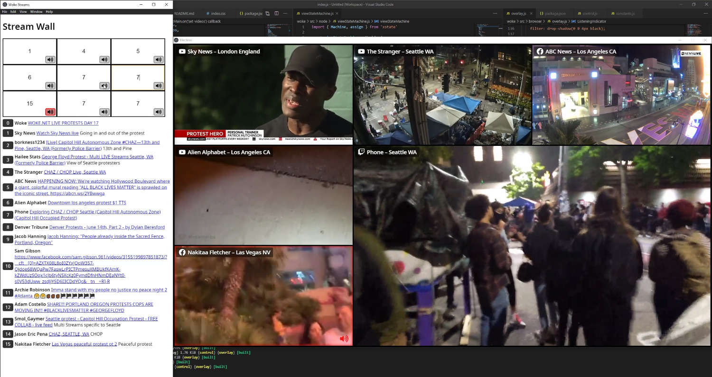

# Streamwall

:construction: Early WIP release! :construction:

Streamwall makes it easy to compose multiple livestreams into a mosaic, with source attributions and audio control.



## How it works

Under the hood, think of Streamwall as a specialized web browser for mosaicing video streams. It uses [Electron](https://www.electronjs.org) to create a grid of web browser views, loading the specified webpages into them. Once the page loads, Streamwall finds the `<video>` tag and reformats the page so that the video fills the space. This works for a wide variety of web pages without specialized scrapers.

## Prerequisites

1. Node.js and npm. Download the LTS release from here - https://nodejs.org/en/

## Setup

1. Download streamwall. You can use git, or download and unzip https://github.com/chromakode/streamwall/archive/main.zip
2. Open the streamwall directory in a console
   - In Windows, the LTS install from nodejs.org will install a program called "Node.js command prompt." Open this program; Command Prompt and Powershell may not have the correct environment variables. Once it's open, change directories to where you extracted the file, e.g., `> cd c:\Users\<myname>\Downloads\streamwall\`
   - On MacOS, you should be able to use the default system terminal or other terminals like iTerm2 as long as a sufficient version of Node is installed. With that open, change directories to where you extracted the file, e.g., `> cd ~/Downloads/streamwall`
3. Run the following command: `npm install`

## To Start Streamwall

1. Using a terminal/console window as described above, go to the streamwall directory, and run `npm run start-local`
2. This will open a black stream window and a browser window. The default username is "streamwall" and the default password is "local-dev".
3. Use the browser window to load or control streams. The initial list will be populated from https://woke.net/#streams
4. If you enter the same stream code in multiple cells, it will merge them together for a larger stream.

## Configuration

Streamwall has a growing number of configuration options. To get a summary run:

```
npm start -- --help
```

For long-term installations, it's recommended to put your options into a configuration file. To use a config file, run:

```
npm start -- --config="../streamwall.toml"
```

See `example.config.toml` for an example.

## Data sources

Streamwall can load stream data from both JSON APIs and TOML files. Data sources can be specified in a config file (see `example.config.toml` for an example) or the command line:

```
npm start -- --data.json-url="https://your-site/api/streams.json" --data.toml-file="./streams.toml"
```

## Twitch bot

Streamwall can announce the name and URL of streams to your Twitch channel as you focus their audio. Use [twitchtokengenerator.com](https://twitchtokengenerator.com/?scope=chat:read+chat:edit) to generate an OAuth token. See `example.config.toml` for all available options.

## Hotkeys

The following hotkeys are available with the "control" webpage focused:

- **alt+[1...9]**: Listen to the numbered stream
- **alt+shift+[1...9]**: Toggle blur on the numbered stream
- **alt+s**: Select the currently focused stream box to be swapped
- **alt+c**: Activate [Streamdelay](https://github.com/chromakode/streamdelay) censor mode
- **alt+shift+c**: Deactivate [Streamdelay](https://github.com/chromakode/streamdelay) censor mode

## Troubleshooting

### Unexpected token errors during `npm install`

We've observed this occur in cases where file corruption is an issue. The fix has been to clear the npm cache, remove the streamwall directory, and start from scratch.

### The Streamwall Electron window only fits 2.5 tiles wide

Streamwall in its default settings needs enough screen space to display a 1920x1080 (1080p) window, with room for the titlebar. You can configure Streamwall to open a smaller window:

```
npm start -- --window.width=1024 --window.height=768
```

## Credits

SVG Icons are from Font Awesome by Dave Gandy - http://fontawesome.io
